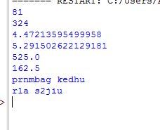
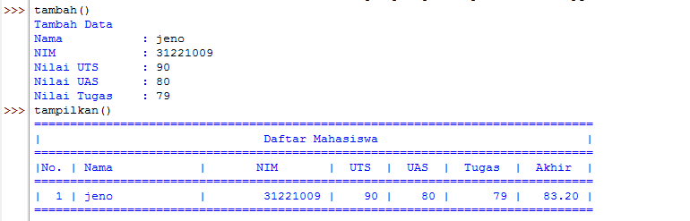
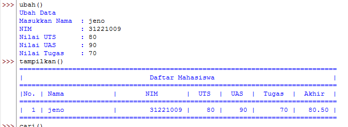
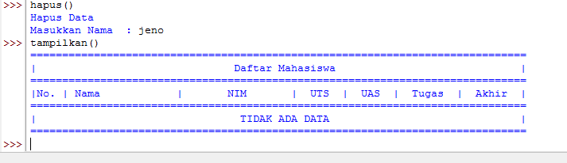

# Praktikum7

---

## Latilan

Ubahlah kode dibawah ini menjadi fungsi menggunakan lambda
```
import math


def a(x):

return x**2


def b(x, y):

return math.sqrt(x*2 + y*2)


def c(*args):

return sum(args)/len(args)


def d(s):

return "".join(set(s))
```

- kode program menggunakan lambda

```
import math

def a(x):
    return x**2
ab = lambda x : x ** 2
print(a(9))
print(ab(18))

def b(x, y):
    return math.sqrt(x*2 + y*2)
bc = lambda x, y :math.sqrt(x*2 + y*2)
print(b(2,8))
print(bc(4,10))

def c(*args):
    return sum(args)/len(args)
cd = lambda*args: sum(args)/len(args)
print(c(1000,50))
print(cd(300,25))

def d(s):
    return "".join(set(s))
de = lambda s :"".join(set(s))
print(d("perempuan berkerudung merah"))
print(de("usus 12 jari"))
```



---

## Tugas Praktikum 

Buat program sederhana dengan mengaplikasikan penggunaan fungsi yang akan menampilkan daftar nilai mahasiswa, dengan ketentuan :

- fungsi tambah() untuk menambahkan data
- fungsi tampilkan() untuk menampilkan data
- fungsi hapus(nama) untuk menghapus data bedasarkan nama
- fungsi ubah(nama) untuk mengubah data bedasarkan nama
- Buat flowchart dan penjelasan program pada README.md
- Commit dan push repository ke github
- Terimakasih ^^
---
- membuat dictionary kosong
```
data = {}
```

- menampilkan data mahasiswa denagn menggunakan fungsi

##### fungsi menambah data

```
def tambah(*t):
    print("Tambah Data")
    nama = input("Nama           : ")
    nim = int(input("NIM            : "))
    uts = int(input("Nilai UTS      : "))
    uas = int(input("Nilai UAS      : "))
    tugas = int(input("Nilai Tugas    : "))
    akhir = tugas*30/100 + uts*35/100 + uas*35/100
    data[nama] = nim, uts, uas, tugas, akhir
    return
```

##### fungsi menampilkan data

```
def tampilkan(*l):
    if data.items():
        print("="*78)
        print("|                               Daftar Mahasiswa                             |")
        print("="*78)
        print("|No. | Nama            |       NIM       |  UTS  |  UAS  |  Tugas  |  Akhir  |")
        print("="*78)
        i = 0
        for z in data.items():
            i += 1
            print("| {no:2d} | {0:15s} | {1:15d} | {2:5d} | {3:5d} | {4:7d} | {5:7.2f} |"
                    .format(z[0][:13], z[1][0], z[1][1], z[1][2], z[1][3], z[1][4], no=i))
        print("=" * 78)
    else:
        print("="*78)
        print("|                               Daftar Mahasiswa                             |")
        print("="*78)
        print("|No. | Nama            |       NIM       |  UTS  |  UAS  |  Tugas  |  Akhir  |")
        print("="*78)
        print("|                                TIDAK ADA DATA                              |")
        print("="*78)
    return
```

##### fungsi menghapus data berdasarkan nama

```
def hapus(*nama):
    print("Hapus Data")
    nama = input("Masukkan Nama  : ")
    if nama in data.keys():
        del data[nama]
    else:
        print("Nama {0} Tidak Ditemukan".format(nama))
    return
```

#### fungsi mengubah data berdasarkan nama

```
def ubah(*nama):
    print("Ubah Data")
    nama = input("Masukkan Nama  : ")
    if nama in data.keys():
        nim = int(input("NIM            : "))
        uts = int(input("Nilai UTS      : "))
        uas = int(input("Nilai UAS      : "))
        tugas = int(input("Nilai Tugas    : "))
        akhir = tugas * 30 / 100 + uts * 35 / 100 + uas * 35 / 100
        data[nama] = nim, uts, uas, tugas, akhir
    else:
        print("Nama {0} tidak ditemukan".format(nama))
    return
```

---

##### hasil ketika sudah dijalankan









